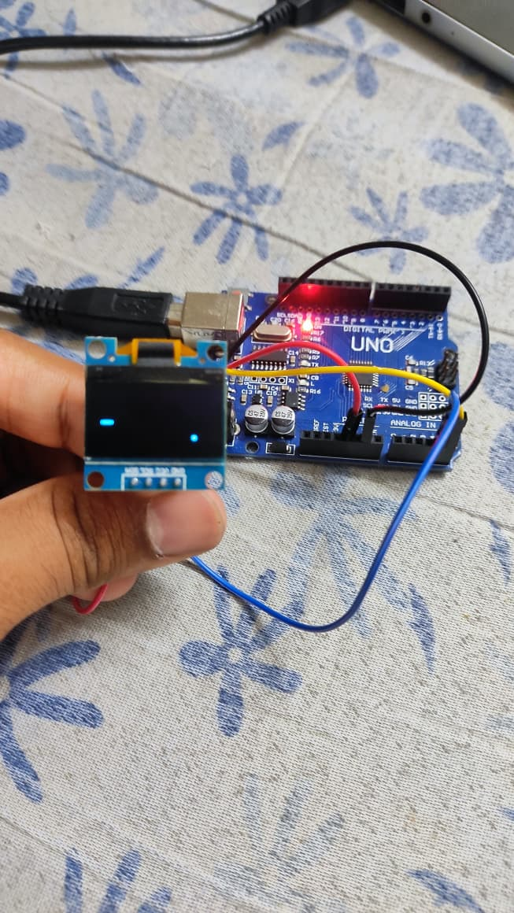
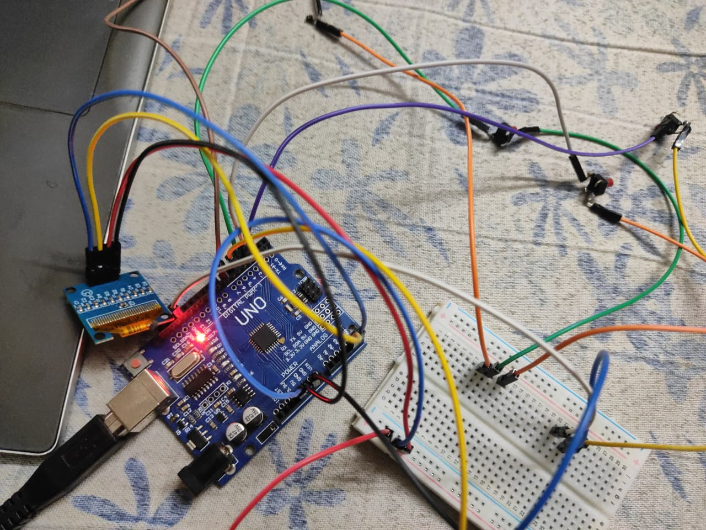
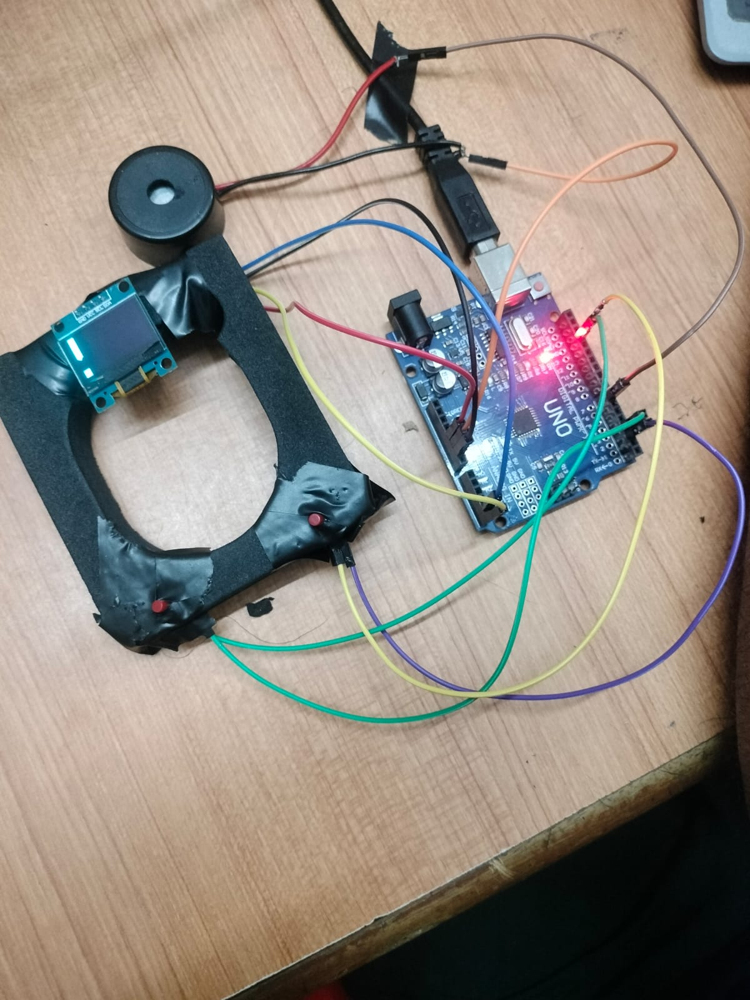

# Arduino-Mini-Game-Console-Oled
Arduino-based Mini Game Console featuring Flappy Bird, Chrome Dino, Pong, and Reaction Test on an OLED display.
## Features

🎮 Multiple Built-in Games
- Flappy Bird
- Chrome Dino
- Pong Pro
- Reaction Test

🔊 Sound Effects
- Menu navigation sounds
- Game score sounds
- Game over effects
- Dino defeat sound

📺 OLED Interface
- Interactive game menu
- Real-time score display
- Game over screen
- Reaction timer display

🎯 Controls
- D2 → UP / Jump / Start
- D3 → DOWN
- D4 → Select / Back to Menu

## Circuit Connections

| Component | Arduino Pin |
|------------|------------|
| Button Up | D2 |
| Button Down | D3 |
| Button Select | D4 |
| Buzzer | D7 |
| OLED SDA | A4 |
| OLED SCL | A5 |

## Libraries Used

- Adafruit GFX
- Adafruit SSD1306
- Wire

## Demo

This project is a handheld Arduino-based gaming console featuring four classic games with OLED graphics and buzzer sound effects.
## Project Images

### Project Setup

### OLED Menu

### Hardware Connections

## Demo Video

Video file uploaded as: 7.mp4
